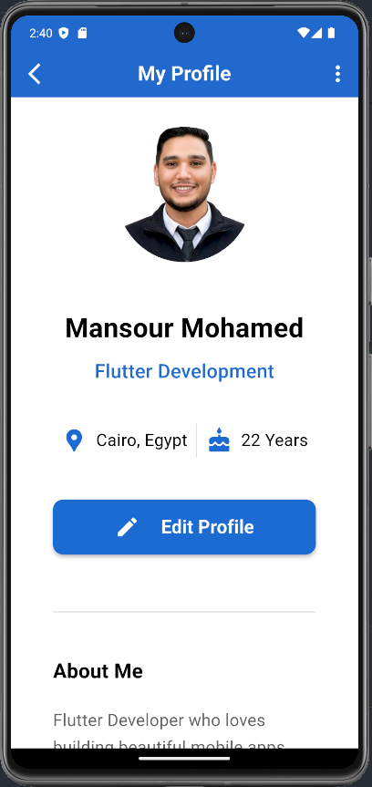
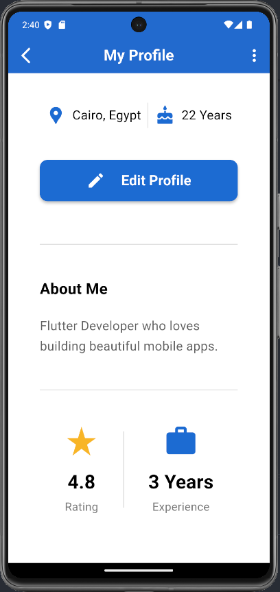

# My Profile App

A simple and clean **Flutter Profile UI** built with Flutter and Dart.

## 📱 Screenshot




## ✨ Features

- Clean and modern profile screen
- Custom AppBar with back and menu actions
- Circular profile image
- User name and job title
- Location and age information
- Edit Profile button
- About Me section
- Rating and experience statistics
- Responsive and scrollable layout

## 🛠️ Technologies

- Flutter
- Dart
- Material Design

## 📂 Project Structure

```text
lib/
├── main.dart
└── core/
    └── appColor.dart

assets/
└── image/
    └── profile.jpg
```

## 🚀 Getting Started

1. Make sure Flutter is installed.
2. Clone or open the project.
3. Add the profile image to:

```text
assets/image/profile.jpg
```

4. Get the dependencies:

```bash
flutter pub get
```

5. Run the application:

```bash
flutter run
```

## 👨‍💻 Developer

**Mansour Mohamed**

Flutter Developer
